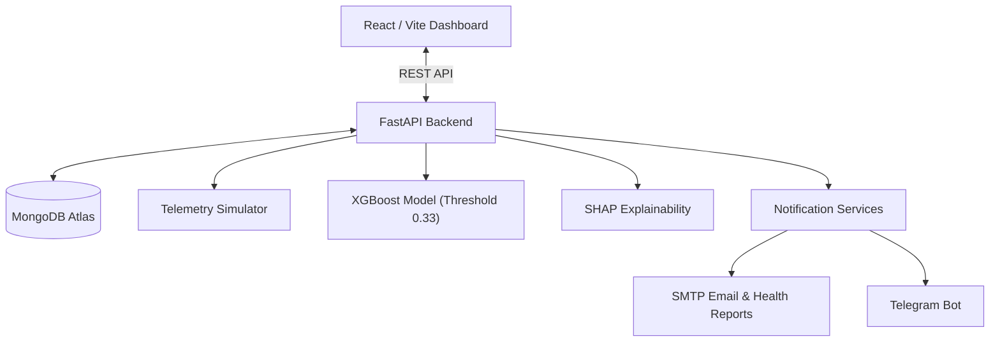

# CNC Sentinel AI

### AI-Powered Predictive Maintenance & Machine Health Monitoring

CNC Sentinel AI is an end-to-end, real-time predictive maintenance and machine health monitoring system engineered for CNC machines and 3D printers. It combines physics-informed telemetry simulation, machine-learning-based failure prediction, SHAP explainability, and multi-channel alerting to detect equipment degradation before critical downtime occurs.

---

## 🚀 Live Demo

**Live Application:** Live deployment: TBD  
**API:** Live deployment: TBD  
**API Docs:** Live deployment: TBD  

*(URLs will be updated once public cloud deployment is complete.)*

---

## 📌 About the Project

In industrial manufacturing, unexpected machine failures cause severe downtime, high repair expenses, and dangerous operating conditions. Traditional calendar-based maintenance often replaces components too early or fails to catch sudden mechanical stress.

**CNC Sentinel AI** addresses this challenge by continuously monitoring streaming physical telemetry (temperatures, vibration, electrical current, spindle speed, tool wear), computing real-time failure probabilities via a calibrated ML classifier, explaining the underlying root causes using SHAP, and delivering automated notifications before catastrophic failures happen.

---

## ✨ Key Features

- **Machine Health Monitoring**: Continuous evaluation of machine health score, operational risk tier, and degradation indicators.
- **CNC/3D-Printer Telemetry Simulation**: Physics-grounded streaming telemetry generator with runtime scenario controls (`normal`, `degrading`, `near_failure`, `sensor_anomaly`).
- **Predictive Failure Detection**: Real-time classification detecting thermal dissipation issues, power failures, overstrain, and tool wear failures.
- **XGBoost Prediction**: High-performance gradient boosted classifier calibrated to prioritize failure recall on imbalanced datasets.
- **SHAP Explainability**: Local TreeSHAP attributions per prediction snapshot showing exact feature-level contributions to failure risk.
- **Health/Risk Monitoring**: Multi-tier categorization (Normal, Warning, Critical) aligned with machine status indicators.
- **Maintenance Tracking**: Comprehensive logging, scheduling, and history audit of preventive and corrective maintenance actions.
- **Telegram Alerts**: Real-time broadcast of critical alerts and incident warnings directly to maintenance channels.
- **Email Notifications**: Immediate operational notifications delivered when telemetry exceeds safety thresholds.
- **Email Machine Health Reports**: User-triggered comprehensive PDF/HTML machine health reports containing full sensor telemetry, latest prediction, maintenance records, and system health status.
- **MongoDB Atlas Persistence**: Cloud-native persistence for machine registries, telemetry records, prediction audits, and maintenance logs.
- **FastAPI Backend**: Asynchronous RESTful API exposing telemetry ingestion, model inference, diagnostics, and notifications.
- **React/Vite Dashboard**: High-responsiveness modern dark-mode operator console with live charts, scenario toggles, and notification management.

---

## 🏗️ System Architecture



---

## 🧠 Machine Learning

- **Model Architecture**: XGBoost Classifier trained on the AI4I 2020 Predictive Maintenance benchmark dataset.
- **Decision Threshold**: `0.33` (specifically calibrated to maximize mechanical failure recall while minimizing false alarms in imbalanced operational settings).
- **Failure Probability**: Evaluates probability of imminent machine failure and maps to actionable risk levels.
- **SHAP Explainability**: Integrates TreeSHAP to compute local Shapley values, highlighting the specific telemetry drivers (e.g., tool wear duration, torque overload, heat dissipation deficit) behind each alert.
- **Defensive Fallback**: A baseline failure model is retained for graceful degradation if native hardware acceleration libraries are constrained.

---

## 📊 Dashboard

The **CNC Sentinel AI** operator dashboard provides:
1. **Overview & Metrics**: Live fleet status, active machine count, high-risk flags, and system connectivity indicator.
2. **Telemetry Visualizer**: Interactive time-series charts for temperature, vibration, current, RPM, and tool wear.
3. **AI Diagnostics & Predictions**: Real-time failure probability gauge, classification verdict, and top contributing SHAP factors.
4. **Simulator Controls**: Live scenario switcher allowing operators to test `Normal`, `Degrading`, and `Near Failure` operational modes in real-time.
5. **Maintenance Log**: Chronological register of service events, scheduled repairs, and historical logs.
6. **Notification Center**: Real-time integration status, one-click test emails, and user-triggered Machine Health Report dispatch.

---

## 🛠️ Technology Stack

| Category | Technology |
|---|---|
| Frontend | React, Vite |
| Backend | FastAPI, Uvicorn |
| Machine Learning | XGBoost, scikit-learn |
| Explainability | SHAP |
| Data Processing | Pandas, NumPy |
| Database | MongoDB Atlas |
| Simulation | Python |
| Notifications | Telegram, SMTP |
| Testing | Pytest |

---

## 📁 Project Structure

```text
predictive-maintenance-ai/
├── backend/                  # FastAPI application, routing, schemas, and services
│   ├── main.py               # REST API entry point & lifecycle management
│   ├── schemas.py            # Pydantic v2 data models
│   └── services/             # Telemetry, prediction, notification, & simulation services
├── frontend/                 # React + Vite operator dashboard
│   ├── src/                  # Components, pages, services, and CSS design system
│   ├── index.html            # Application entry page
│   └── package.json          # Frontend dependencies & build scripts
├── simulator/                # Virtual telemetry simulation engine
├── ml/                       # Model training, feature engineering, and SHAP explainability
├── models/                   # Serialized model artifacts (.joblib, metadata JSON)
├── database/                 # MongoDB Atlas connection manager and schemas
├── data/                     # Benchmark datasets and simulation logs
├── tests/                    # Automated pytest validation suite
├── config/                   # Centralized configuration & schema contracts
├── .env.example              # Environment variable template
├── .gitignore                # Version control exclusions
├── requirements.txt          # Pinned Python package dependencies
└── README.md                 # Project documentation
```

---

## ⚙️ Local Setup

### 1. Environment Setup
```bash
# Clone the repository
git clone <repository_url>
cd predictive-maintenance-ai

# Activate your Python environment (Python 3.10+)
# e.g., on Windows:
.\venv\Scripts\activate

# Install dependencies
pip install -r requirements.txt

# Configure environment variables
cp .env.example .env
# Edit .env to add your MONGODB_URI and optional SMTP / Telegram credentials
```

### 2. Backend Startup
```bash
python -m uvicorn backend.main:app --host 0.0.0.0 --port 8000 --reload
```
API Documentation will be available at `http://localhost:8000/docs`.

### 3. Frontend Startup
```bash
cd frontend
npm install
npm run dev
```
Dashboard will be available at `http://localhost:3000`.

---

## 🧪 Testing

The test suite validates data preparation, database operations, API endpoints, simulator dynamics, and notification pipelines:

```bash
python -m pytest -q
```

**Verified Test Result:**
- `63 passed, 17 warnings`

---

## ⚠️ Important Disclaimer

"This project uses simulated machine telemetry and is a software prototype. It has not been validated against live industrial CNC sensor hardware."

---

## 🎤 Project Introduction

"CNC Sentinel AI is an AI-powered predictive maintenance platform designed for CNC machines and 3D printers. It combines machine telemetry simulation, machine-failure prediction, SHAP-based explainability, real-time health monitoring, maintenance tracking, and automated alerts. The platform uses FastAPI for the backend, React and Vite for the dashboard, MongoDB Atlas for persistence, and XGBoost for predictive maintenance."

---

## 🧰 Tech Stack Script

"The frontend is built with React and Vite, while the backend uses FastAPI and Uvicorn. XGBoost and scikit-learn power the predictive maintenance model, with SHAP providing model explainability. MongoDB Atlas stores machine, telemetry, prediction, and maintenance information. Python powers the simulator and backend services, while Pytest is used for automated testing."
